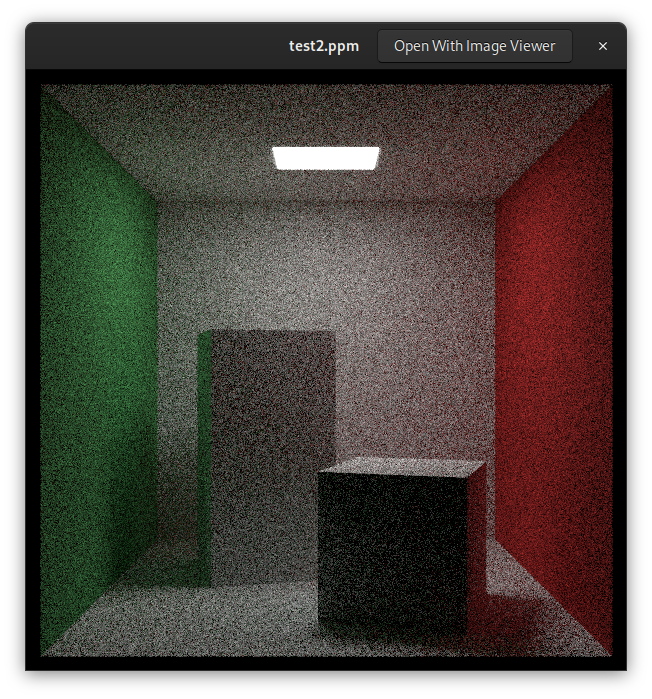
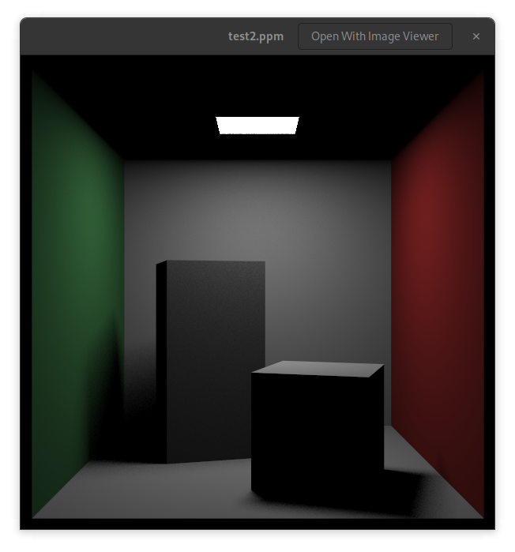
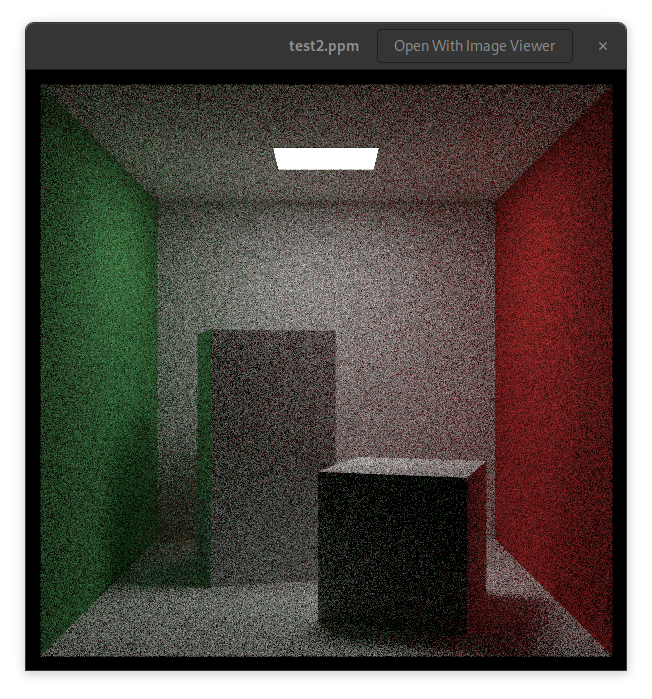
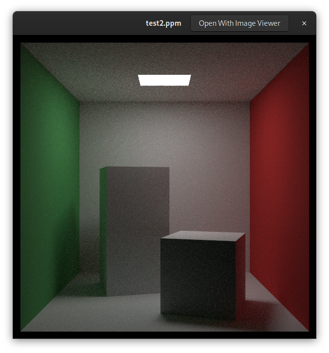

# Ray-Tracing-the-rest-of-your-life--in-C

I am following the book [Ray Tracing: the rest of your life](https://raytracing.github.io/books/RayTracingTheRestOfYourLife.html) by Peter Shirley and others. This is a continuation of the Ray Tracing in One Weekend and Ray Tracing: the Next Week series. The book is available for free online.
The book is a great resource for learning about ray tracing and computer graphics in general. It is written in a very accessible way and is a great way to learn about the subject. 

This version is in C for my enjoyment and learning. 
I already have the C verion of the two previous books in my repositories:
- [Ray-Tracing-in-One-Weekend--in-C](https://github.com/multitudes/Ray-Tracing-in-One-Weekend-in-C/tree/main)
- [Ray-Tracing-the-next-week--in-C](https://github.com/multitudes/Ray-Tracing-The-Next-Week-in-C)  

And the current repo is the third in the series.  
For me the main reason to follow the third book is having a better understanding of the math involved and a better way of managing lights.  Mostly there are two ways to handle lights, using shadow rays or deciding instead to make rays more likely to go toward lights using probabilistic density functions like the book does.  Not covered are bidirectional methods, Metropolis methods, or photon mapping.  That said I am very happy with the result I achieved following this tutorials and my goal is NOT to create a professional raytracing engine.  Again thank you to the authors for this great piece of work they put out for free.  

## Monte Carlo Algorithms
There are two kinds of randomized algorithms: Monte Carlo and Las Vegas.  A randomized algorithm uses some amount of randomness in its computation. A Las Vegas (LV) random algorithm always produces the correct result but its running time is probabilistic, whereas a Monte Carlo (MC) algorithm may produce a correct result for a defined running time.  
An example of a LV algo is the code we wrote to pick up a random point in a unit sphere. It always produces a point in the sphere but we cannot say how long it will take.  On the other side a MC algo will give a statistical estimate and will get more and more accurate the longer you run it. 

### Example of estimating $\pi$ with Monte Carlo
An example of an application of the Monte Carlo algo is to calculate numerical integration using random sampling.  
If we have a square and a circle inside it, and we pick a random point in the square, the probability that the point is inside the circle is the ratio of the area of the circle to the area of the square.

$$ \frac{\pi r^2}{(2r)^2} = \frac{ \pi }{4} $$

Lets try this in code:

```c
int main()
{
	int N = 1000000;
	int inside_circle = 0;
	for (int i = 0; i < N; i++)
	{
		double x = random_double(-1, 1);
		double y = random_double(-1, 1);
		if (x * x + y * y < 1)
			inside_circle++;
	}
	printf("PI is approximately %f\n", 4 * inside_circle / (double)N);
	return 0;
}
```
I get PI =  3.142872. Actually better than the book (3.14376) :)

If we keep the program running for longer we experience an example of the law of Law of Diminishing Returns, the more we run the program the less the improvement in the result.  
There is a technique called jittering, which subdivides the areas in smaller squares and then randomly picks a point in each square. This is a way to improve the accuracy of the result.  but also the advantage decreases as we increase the dimensions (the "Curse of Dimensionality").

Lets see how much improvement we get with jittering:

```c
// approximate the value of PI using monte carlo method w jittering
int main()
{
	int inside_circle_stratified = 0;
	int sqrt_N = 1000;
	for (int i = 0; i < sqrt_N; i++)
	{
		for (int j = 0; j < sqrt_N; j++)
		{
			double x = (i + random_double(0, 1)) / sqrt_N;
			double y = (j + random_double(0, 1)) / sqrt_N;
			if (x * x + y * y < 1)
				inside_circle_stratified++;
		}
	}
	printf("PI is approximately %f\n", 4 * inside_circle_stratified / (double)(sqrt_N * sqrt_N));
}
```
I get pi approximately 3.141660. Interestingly the books authors get 3.14146... the value of pi is 3.141592653589... so we are not that far off but the stratified method is better and converges with a better rate than the simple Monte Carlo method.

So we will change our rendering method to use stratified sampling.

In our camera struct we will introduce the number of samples per pixel:

```c
    int    sqrt_spp;             // Square root of number of samples per pixel
    double recip_sqrt_spp;       // 1 / sqrt_spp

	[in init..]
    sqrt_spp = int(sqrt(samples_per_pixel));
    pixel_samples_scale = 1.0 / (sqrt_spp * sqrt_spp);
    recip_sqrt_spp = 1.0 / sqrt_spp;

// and in the render function the inner loop will change
for (int s_j = 0; s_j < c.sqrt_spp; s_j++) {
	for (int s_i = 0; s_i < c.sqrt_spp; s_i++) {
		t_ray r = get_ray(&c, i, j, s_i, s_j);
		t_color partial = ray_color(c, &r, c.max_depth, &world, &lights);
		pixel_color = vec3add(pixel_color, partial);
	}
}

...
and in get_ray we have a different offset
t_vec3	offset = sample_square_stratified(c, s_i, s_j);

```

before and after the optimization:
<div style="text-align: center;">
 

</div>

OK I dont see much difference in the image quality. I am really looking forward to the part where they manage to diminish the amount of noise in the image.  


## Density Functions

Here it gets interesting. As in the book:
> The ray_color function that we wrote in the first two books, while elegant in its simplicity, has a fairly major problem. Small light sources create too much noise. This is because our uniform sampling doesn’t sample these light sources often enough. Light sources are only sampled if a ray scatters toward them, but this can be unlikely for a small light, or a light that is far away. If the background color is black, then the only real sources of light in the scene are from the lights that are actually placed about the scene

This is exacly what I think when I see the cornells box with the light source. The light source is so small that it is not sampled enough and the image is very noisy.

The book here explains the PDF (Probability Density Function) and how to use it to sample the light sources more efficiently.
We want to sample the light sources more often than the other parts of the scene but without have a too big bias in the image... 

We look again at our random double generator function and we introduce the concept of importance sampling.  
A nonuniform PDF “steers” more samples to where the PDF is big, and fewer samples to where the PDF is small. By this sampling, we would expect less noise in the places where the PDF is big and more noise where the PDF is small.  

for Monte Carlo ray tracers: 
- we have an integral of $f(x)$ over some domain $[a,b]$
- we pick a PDF p that is non-zero and non-negative over $[a,b]$
- average a whole many samples of $f(r)/p(r)$ where r is a random number with PDF p

Any choice of PDF p will always converge to the right answer, but the closer that p approximates f, the faster that it will converge. 

## our goal is to reduce the noise 
We’ll do that by constructing a PDF that sends more rays to the light.  

I will add a new function signature in my material.
```c

typedef struct 		s_material
{
	bool 			(*scatter)(void *self, const t_ray *r_in, const t_hit_record *rec, t_color *attenuation, t_ray *scattered);
	t_color			(*emit)(void *self, double u, double v, t_point3);
	double 			(*scattering_pdf)(void *self, const t_ray *r_in, const t_hit_record *rec, const t_ray *scattered);

}					t_material;
```

And add a lambertian_scattering_pdf function to match that signature for lambertian materials.

```c
// in the lambertian init function
	lambertian_material->base.scattering_pdf = lambertian_scatter_pdf;
// and the function
double lambertian_scatter_pdf(void* self, const t_ray *r_in, const t_hit_record *rec, const t_ray *scattered) 
{
	(void)r_in;
	(void)self;
	double cos_theta = dot(rec->normal, unit_vector(scattered->dir));
        return cos_theta < 0 ? 0 : cos_theta/PI;
}
```

In the camera ray function we will use the PDF to sample the light sources taking into account this new function.

```c
{
	...
	double scattering_pdf = rec.mat->scattering_pdf(rec.mat, r, &rec, &scattered);
	double pdf = scattering_pdf;
	t_color attenuationxscattering_pdf = vec3multscalar(attenuation, scattering_pdf);
	t_color color_from_scatter_partial = vec3mult(attenuationxscattering_pdf, ray_color(cam, &scattered, depth-1, world));
	t_color color_from_scatter = vec3divscalar(color_from_scatter_partial, pdf);
		
	return vec3add(color_from_emission, color_from_scatter);
}
```
Right now since we did not implement the PDF we get exactly the same picture as before.  

The problem with sampling uniformly over all directions is that lights are no more likely to be sampled than any arbirary or unimportant direction. 
Many ray tracers use shadow rays to solve for the direct lighting at any given point. Instead, we will use a PDF. 

So the first step is a test using hardcoded values for the light... and I get this:
<div style="text-align: center;">

</div>

it looks good... So it is working.

## Albedo recap
When we simulate light propagation, all we're doing is simulating the movement of photons through a space.  
Every photon has a unique energy and wavelength associated by the Planck constant: 

$$E = \frac{hc}{\lambda}$$

If you remember your phisics here's what each symbol represents:

- $ E $: The energy of the photon.
- $ h $: Planck's constant, which is approximately $ 6.626 \times 10^{-34} $ Joule seconds (Js).
- $ c $: The speed of light in a vacuum, which is approximately $ 3 \times 10^8 $ meters per second (m/s).
- $ \lambda $: The wavelength of the photon, typically measured in meters (m).

The energy $ E $ of a photon is inversely proportional to its wavelength $\lambda $. In other words, as the wavelength of the photon decreases, its energy increases, and vice versa.

- Planck's constant $ h $: This is a fundamental constant in quantum mechanics that relates the energy of a photon to its frequency.
- Speed of light $ c $: This is the speed at which light travels in a vacuum.
- Wavelength $ \lambda $: This is the distance between successive peaks (or troughs) of the electromagnetic wave.

### Derivation

The equation can be derived from the relationship between the energy of a photon and its frequency $ \nu $:

$$ E = h\nu $$

Since the speed of light \( c \) is related to the wavelength and frequency by the equation:

$$ c = \lambda \nu $$

We can solve for the frequency $ \nu $:

$$ \nu = \frac{c}{\lambda} $$

Substituting this into the energy equation:

$$ E = h \left( \frac{c}{\lambda} \right) $$

This simplifies to:

$$ E = \frac{hc}{\lambda} $$


> The absorption or scattering of a photon with a surface or a volume (or really anything that a photon can interact with) is probabilistically determined by the albedo of the object. Albedo can depend on color because some objects are more likely to absorb some wavelengths. 

Interestingly some renderers are using not RGB but an approximation of how the human eye works. We have 3 main types of cones in the human eye: L, M, and S. These cones are sensitive to different wavelengths of light. The L cones are sensitive to long wavelengths, the M cones are sensitive to medium wavelengths, and the S cones are sensitive to short wavelengths. The RGB color space is a good approximation of the LMS color space.

## Scattering 
When the light scatters, it will have a directional distribution. A PDF over a solid angle.
Lambertian is a specific type of diffuse material that requires a cos(θo) scattering distribution... 

## Importance sampling
Our goal will be to instrument our program to send a bunch of extra rays toward light sources so that our picture is less noisy. Lets construct a PDF that sends more rays to the light. 
We add this function to our material struct
```c
double 			(*scattering_pdf)(void *self, const t_ray *r_in, const t_hit_record *rec, const t_ray *scattered);
```
and in the Lambertian material we add the function
```c
double lambertian_scatter_pdf(void* self, const t_ray *r_in, const t_hit_record *rec, const t_ray *scattered) 
{
	(void)r_in;
	(void)self;
	double cos_theta = dot(rec->normal, unit_vector(scattered->dir));
        return cos_theta < 0 ? 0 : cos_theta/PI;
}
```


[more math follows in book]

## Orthonormal bases
An orthonormal basis (ONB) is a collection of three mutually orthogonal unit vectors.
We need methods to generate random directions to produce reflections off of any surface, So they need to support arbitrary surface normal vectors and ONB will come into play.

Since we need to use ONB we can make a struct and utility functions for it!

```c
typedef struct 	s_onb {
    t_vec3		u;
	t_vec3		v;
	t_vec3		w;
} 				t_onb;
```

```c
/**
 * onb_build_from_w - Builds an orthonormal basis from a given vector.
 * @basis: Pointer to the t_onb structure where the basis will be stored.
 * @w: Pointer to the t_vec3 vector to align the w basis vector with.
 *
 * This function constructs an orthonormal basis (u, v, w) where the w vector
 * is aligned with the given input vector. The u and v vectors are computed
 * to be orthogonal to w and to each other, forming a right-handed coordinate
 * system.
 */
void onb_build_from_w(t_onb *basis, const t_vec3 *w) 
{
    t_vec3 a;
    t_vec3 v;
    t_vec3 u;
    t_vec3 unit_w;
	
	unit_w = unit_vector(*w);
	a = (fabs(unit_w.x) > 0.9) ? vec3(0,1,0) : vec3(1,0,0);
	v = unit_vector(cross(unit_w, a));
	u = cross(unit_w, v);
    basis->u = u;
    basis->v = v;
    basis->w = unit_w;
}

/**
 * onb_local - Converts coordinates from the local orthonormal basis to world coordinates.
 * @basis: Pointer to the t_onb structure representing the orthonormal basis.
 * @a: Scalar component along the u basis vector.
 * @b: Scalar component along the v basis vector.
 * @c: Scalar component along the w basis vector.
 *
 * This function takes coordinates (a, b, c) in the local orthonormal basis
 * defined by the given t_onb structure and converts them to world coordinates.
 * The resulting vector is the sum of the basis vectors scaled by their respective
 * components.
 *
 * Return: A t_vec3 vector representing the coordinates in world space.
 */
t_vec3 onb_local(const t_onb *basis, double a, double b, double c) 
{
	t_vec3 ua;
	t_vec3 vb;
	t_vec3 wc;
	
	ua = vec3multscalar(basis->u, a);
	vb = vec3multscalar(basis->v, b);
	wc = vec3multscalar(basis->w, c);
    return vec3add(vec3add(ua, vb), wc);	
}

/**
 * onb_local_vec - Converts a vector from the local orthonormal basis to world coordinates.
 * @basis: Pointer to the t_onb structure representing the orthonormal basis.
 * @a: t_vec3 vector in the local orthonormal basis.
 *
 * This function takes a vector 'a' in the local orthonormal basis defined by the
 * given t_onb structure and converts it to world coordinates. The resulting vector
 * is the sum of the basis vectors scaled by their respective components from 'a'.
 *
 * Return: A t_vec3 vector representing the coordinates in world space.
 */
t_vec3 onb_local_vec(const t_onb *basis, t_vec3 a) 
{
	t_vec3 uax = vec3multscalar(basis->u, a.x);
	t_vec3 vay = vec3multscalar(basis->v, a.y);
	t_vec3 waz = vec3multscalar(basis->w, a.z);
    return vec3add(vec3add(uax, vay), waz);	
}
```
We will add a pdf property to our scatter function in the material struct. 
```c
bool 			(*scatter)(void *self, const t_ray *r_in, const t_hit_record *rec, t_color *attenuation, t_ray *scattered, double *pdf);
```
and the lambertian scatter function will be updated to include the pdf

```c
bool lambertian_scatter(void* self, const t_ray *r_in, const t_hit_record *rec, t_color *attenuation, t_ray *scattered, double *pdf)  
{
	(void)r_in;
	t_onb uvw;
	
	onb_build_from_w(&uvw, &(rec->normal));
	t_lambertian *lamb = (t_lambertian *)self;
	t_vec3 scatter_direction = onb_local_vec(&uvw, random_cosine_direction());
    *scattered = ray(rec->p, unit_vector(scatter_direction), r_in->tm);
    *attenuation = lamb->texture->value(lamb->texture, rec->u, rec->v, &rec->p);
	*pdf = dot(uvw.w, scattered->dir) / PI;
    return true; 
}
```
<div style="text-align: center;">

</div>

This optimisation is not yet visible in the image.  
The problem with sampling uniformly over all directions is that lights are no more likely to be sampled than any arbitrary or unimportant direction.

We need the PDF of the light so as not to bias the image too much.

Since we are using quite a lot of PDF's we will create a struct.

So we will have different PDF's for surface `pSurface` and light `plight`.

```c
typedef struct	s_pdf
{
	double (*value)(void *self, const t_vec3 *direction);
	t_vec3 (*generate)(void *self);
}				t_pdf;


typedef struct	s_sphere_pdf
{
	t_pdf	base;
}				t_sphere_pdf;
```

For a sphere:
```c
double sphere_pdf_value(void *self, const t_vec3 *direction)
{ 
	(void)self;
	(void)direction;
	return 1/ (4 * PI);
}

t_vec3 sphere_pdf_generate(void *self)
{
	return random_unit_vector();
}
```

So after refactoring our ray_color function in the camera we get 
<div style="text-align: center;">

</div>

it is still noisy because we did not yet implement sampling toward a direction like the light which will be done next.

## Sampling Directions towards a Hittable 

We will add a new function to our material struct to sample a direction towards a hittable object. 
```c

```

this is the result combining the lambertian and light pdfs.
<div style="text-align: center;">

</div>

The mixture-density approach is an alternative to having more traditional shadow rays.


TODO:

- add the pdf function for the sphere. 
- fix the pdf for materials like meta and dielectric which are now incidentally broken by the refactoring
- still need x and z rotations. 
- cyclinder? and its pdfs
- more lights and colors
- bump mapping, should be easy to do when we have the normal mapping and the texture mapping


## Links
- [Raytracing in one weekend](https://raytracing.github.io/books/RayTracingInOneWeekend.html)
- [Raytracing the next week](https://raytracing.github.io/books/RayTracingTheNextWeek.html)
- [Raytracing the rest of your life](https://raytracing.github.io/books/RayTracingTheRestOfYourLife.html)
- stb_image.h, a header-only image library available on GitHub at https://github.com/nothings/stb.
- [https://gabrielgambetta.com/computer-graphics-from-scratch/](https://gabrielgambetta.com/computer-graphics-from-scratch/)
- A raytracer on the back of a business card. [https://fabiensanglard.net/rayTracing_back_of_business_card/](https://fabiensanglard.net/rayTracing_back_of_business_card/)
Here are a few really good resources by [Fabien Sanglard](https://fabiensanglard.net/about/index.html):

- scratchapixel.com : Great raytracer lessons written by professionals that have worked on Toy Story, Avatar, Lord of the Rings, Harry Potter, Pirates of the Caribbean and many other movies.
- An Introduction to Ray Tracing : An old book but a Classic.
- Physically Based Rendering : Heavy on maths but really good and well explained.

- A great youtube series https://www.youtube.com/playlist?list=PLlrATfBNZ98edc5GshdBtREv5asFW3yXl


- [https://www.conventionalcommits.org/en/v1.0.0](https://www.conventionalcommits.org/en/v1.0.0)

- Cross Product [https://en.wikipedia.org/wiki/Cross_product#/media/File:Cross_product_mnemonic.svg](https://en.wikipedia.org/wiki/Cross_product#/media/File:Cross_product_mnemonic.svg)
- and alsd [https://www.mathsisfun.com/algebra/vectors-cross-product.html](https://www.mathsisfun.com/algebra/vectors-cross-product.html)
